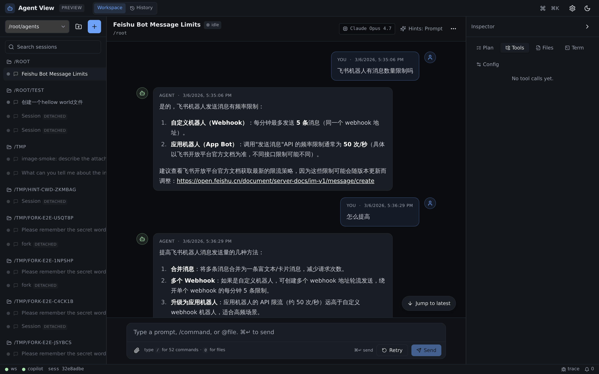
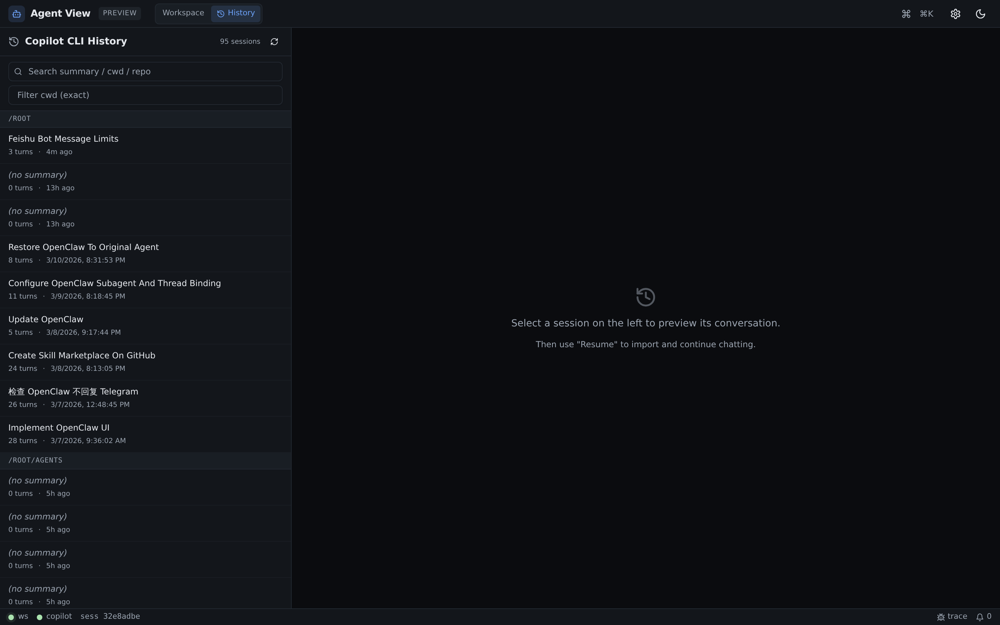
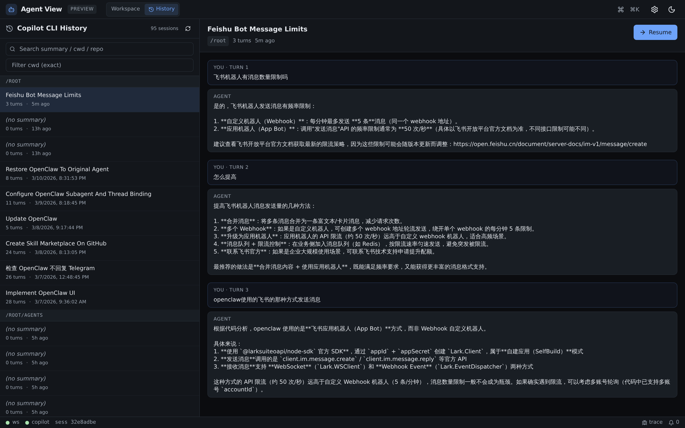

# Copilot Deck

> Browser-based multi-session control panel for the **GitHub Copilot CLI**,
> built on the [Agent Client Protocol (ACP)](https://agentclientprotocol.com).

Run many Copilot CLI sessions side-by-side in a real UI: rich streaming
chat, tool-call timeline, diff viewer, git checkpoints, image input,
cross-session search, fan-out, fork, and full read-and-resume access to
the CLI's own historical sessions.

> Protocol: JSON-RPC 2.0 over stdio NDJSON · CLI: `copilot --acp --stdio` ·
> SDK: official [`@agentclientprotocol/sdk`](https://www.npmjs.com/package/@agentclientprotocol/sdk).

## Screenshots

**Workspace** — sidebar grouped by cwd, streaming conversation, inspector with Plan / Tools / Files / Term tabs, per-session model + render-hints status.



**Copilot CLI history** — read every session in `~/.copilot/session-store.db`, search/filter by cwd, preview the full turn history, and **Resume** to adopt it as a live ACP session.




---

## Features

### Session management
- Multi-cwd / multi-session in parallel; sidebar grouped by cwd with
  collapse, rename, delete, duplicate, **fork from any message** (carries
  condensed prior context), and **fan-out** broadcast to selected sessions.
- Detached sessions get a ↻ Reattach button — `loadSession` replays the
  Copilot context so you keep chatting where you left off.
- **Copilot CLI history tab**: browse every session in
  `~/.copilot/session-store.db`, preview turns, and **Resume** to adopt
  one as a live agent-view session.

### Composer
- ⌘↵ send · Esc cancel · ↑/↓ recall prior prompts.
- `/` opens the slash-command popover (20+ builtins + agent commands).
- `@` opens fuzzy file mention.
- **Image input**: paste a screenshot, drag-and-drop, or use the
  paperclip — sent as ACP `image` content blocks with 8 MB / 16 MB caps.

### Conversation
- Markdown + on-demand Shiki highlighting; streaming cursor; per-message
  copy / edit-and-resend / regenerate / **restore from git checkpoint**
  taken before that prompt.
- Inline rich rendering: tables → sortable grids, mermaid diagrams,
  KaTeX math, JSON tree, CSV charts, sanitised SVG, HTML sandboxed
  in srcdoc iframes, shell-command blocks with "send to composer".
- Long content auto-hoisted into a resizable right-side **Artifact pane**.

### Tool-call timeline
- `tool_call` / `tool_call_update` merged into cards: diff (unified +
  split + "open in editor"), terminal output (middle-fold for long
  runs), text/JSON/image content, plan updates.
- Inspector mirrors the timeline with a count badge.

### Files inspector (v2)
- Per-session **touched files** with git-aware badges (added / modified
  / deleted / untracked), agent attribution dots, **stash all agent
  changes**, **restore from latest checkpoint**.
- Workspace-wide diff overview, breadcrumb file viewer.
- Degrades cleanly when cwd isn't a git repo.

### Git checkpoints
- One stash snapshot taken automatically before every prompt; surfaced
  as a per-message Restore button that previews changed files before
  rewinding the worktree.

### Cross-session search
- ⌘⇧F overlay: FTS5 search across every message in every session,
  jumps straight to the matching bubble.

### Render-hints
- Auto-injects an `AGENTS.md` (or first-prompt prefix) so Copilot emits
  fenced blocks Copilot Deck knows how to render (tables, mermaid,
  katex, csv-charts, etc.). Per-session opt-out.

### Permissions
- Real `PermissionBroker` with 5 min default-deny timeout; allow-always
  / reject-always decisions persisted per `(cwd, toolName)` in SQLite.

### Models
- Curated picker (Claude 4.5-4.7 / Sonnet / Haiku / GPT-5.x / Codex /
  Gemini / Lark). Switching restarts the cwd's Copilot child with
  `--model <id>`. Per-session override supported.

### Persistence + observability
- SQLite (WAL): `sessions / messages / tool_calls / permissions /
  trace_events / reviewed_files / checkpoints` + message attachments.
- WS hydrate snapshot on connect; exponential-backoff client reconnect.
- JSON-RPC **Trace drawer** with direction + session filters and
  expandable payloads.

---

## Architecture

```
┌────── Browser (Vite + React + Zustand + Tailwind + shadcn/ui) ──────┐
│  TopBar (Workspace | History) · Sidebar · Conversation · Composer  │
│  Inspector (Tools / Files / Skills / Extensions) · Artifact pane   │
└──────────────┬───────────────────────────────────────┬─────────────┘
               │ WebSocket (typed C↔S messages)        │ REST /api/*
               ▼                                       ▼
┌─── Fastify (packages/server) ──────────────────────────────────────┐
│  routes.ts       · /api/{health, sessions, models, files, file,    │
│                    list-dir, git-info, trace, mkdir, open-editor,  │
│                    checkpoints, search, copilot-history/*}         │
│  ws-handlers.ts  · Record<msgType, handler> dispatch               │
│  session-manager · CopilotAgent per cwd, perm broker, hydrate,     │
│                    reattach, fork, fan-out, importExternalSession  │
│  acp/persist.ts  · sessionUpdate → SQLite mirror                   │
│  acp/copilot-agent · spawn + ACP ClientSideConnection              │
│  store.ts        · better-sqlite3 (WAL)                            │
│  copilot-history · read-only adapter over ~/.copilot/session-store │
│  git-checkpoint  · per-prompt stash + restore                      │
└──────────────────────────────┬─────────────────────────────────────┘
                               │ stdio NDJSON
                               ▼
                   copilot --acp --stdio --model <id>
```

## Repo layout (pnpm workspaces)

```
packages/
├── shared/   shared WS protocol types + curated model list
├── server/   Fastify + WebSocket + ACP client + SQLite
├── web/      Vite + React + Tailwind + shadcn/ui
└── cli/      published `copilot-deck` npm bin + bundled server/web
scripts/
├── smoke.mjs       end-to-end WS smoke (dev server)
├── smoke-cli.mjs   end-to-end smoke of the installed bin
└── build-cli-bundle.mjs  bundles server+web+shared into packages/cli/dist-bundle
plan.md         full design, UI wireframes, milestones
```

## Install

Requires Node.js ≥ 22 and a working `copilot` CLI on `PATH`
(`copilot --version` works, `copilot --acp --stdio` available).

```bash
# one-shot
npx copilot-deck

# or install globally
npm install -g copilot-deck
copilot-deck
```

The CLI:

- spawns the bundled server, picks a free port near `4173`,
- serves the prebuilt web UI from the same origin,
- opens your default browser,
- polls GitHub Releases once a day and surfaces a non-intrusive banner
  when a newer version is published.

Common flags:

```
copilot-deck                       # start (default)
copilot-deck start --port 4200 --no-open --no-update-check
copilot-deck doctor                # Node / Copilot CLI / data dir / sqlite
copilot-deck version
copilot-deck data-dir
copilot-deck upgrade               # print upgrade command
copilot-deck upgrade --run         # spawn `npm i -g copilot-deck@latest`
copilot-deck --help
```

## Upgrade

The banner inside the app shows the latest released version with a
copy-to-clipboard install command, link to release notes, and a 7-day
snooze. Upgrading is always explicit — Copilot Deck never installs
itself.

```bash
npm install -g copilot-deck@latest
# or
copilot-deck upgrade --run
```

After upgrading, restart the `copilot-deck` process.

## Data directory

By default Copilot Deck stores its SQLite database, update cache, and
permissions decisions under `~/.copilot-deck/`. On first run it copies
any pre-existing `~/.agent-view/` (used before the rename) so your
history survives the migration. The legacy directory is left untouched
as a safety net.

Resolution order:

1. `AGENT_VIEW_DB` — full path to `db.sqlite` (legacy override)
2. `COPILOT_DECK_HOME` — directory; `db.sqlite` is created inside it
3. `~/.copilot-deck/db.sqlite`

`copilot-deck data-dir` prints the resolved location.

## Development

```bash
pnpm install
pnpm dev   # server :4000 + Vite :5173 (proxies /api and /ws)
```

Open <http://localhost:5173> → pick or type a cwd → **Create session** →
prompt away.

Per-package:

```bash
pnpm --filter @agent-view/server dev
pnpm --filter @agent-view/web dev
```

Build + run the published CLI locally (uses the embedded prebuilt
bundle):

```bash
pnpm build                                 # server + web + cli bundle
node packages/cli/bin/copilot-deck.mjs     # same entry npm users get
pnpm smoke:cli                             # end-to-end bin smoke
```

Quality gates:

```bash
pnpm lint        # biome check (0 errors)
pnpm typecheck   # tsc --noEmit across all workspaces
```

## Environment variables

| Variable | Default | Notes |
|---|---|---|
| `PORT` | `4173` (CLI) / `4000` (`pnpm dev`) | Server listen port |
| `HOST` | `127.0.0.1` | Server listen address |
| `COPILOT_CLI_PATH` | `copilot` (PATH) | Copilot CLI executable |
| `COPILOT_DEFAULT_MODEL` | `~/.copilot/settings.json::model` ?? `claude-sonnet-4.5` | Default `--model` when spawning |
| `COPILOT_DECK_HOME` | `~/.copilot-deck` | Data directory |
| `AGENT_VIEW_DB` | _(unset)_ | Full path override (legacy) |
| `AGENT_VIEW_TRACE_MAX` | `5000` | trace_events rotation cap |
| `AGENT_VIEW_EDITOR` | `code` | "Open in editor" launcher |
| `COPILOT_DECK_STATIC_DIR` | _(set by CLI bundle)_ | Static web assets dir served by Fastify |
| `COPILOT_DECK_DISABLE_UPDATE_CHECK` | _(unset)_ | `=1` to skip the GitHub Releases poll |
| `COPILOT_DECK_VERSION` | _(set by CLI bundle)_ | Reported by `/api/version` |

## Status

Working preview, dark theme only. Stable enough for daily multi-session
use against `copilot --acp --stdio`. See [`plan.md`](./plan.md) for the
full design, UI wireframes, future work (multi-agent backends, remote
deploy, Tauri shell, collaboration), and a per-milestone changelog
that mirrors the git history.

## License

MIT (see [LICENSE](./LICENSE) if present, otherwise default repo terms).
